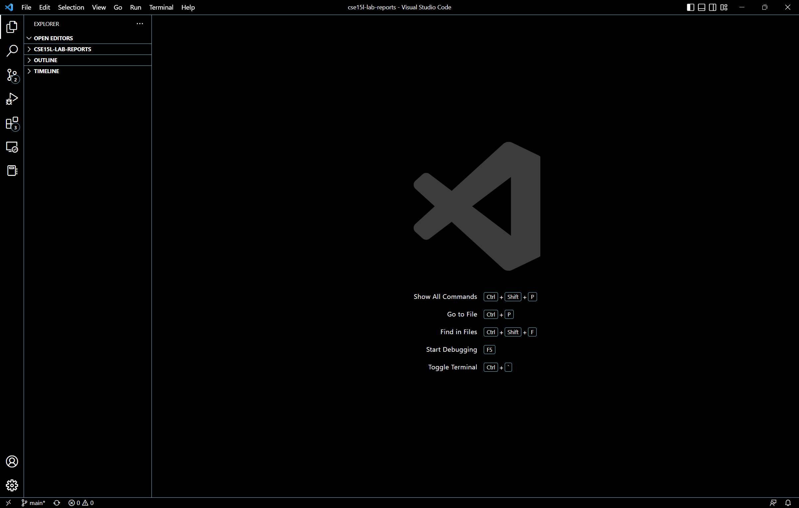
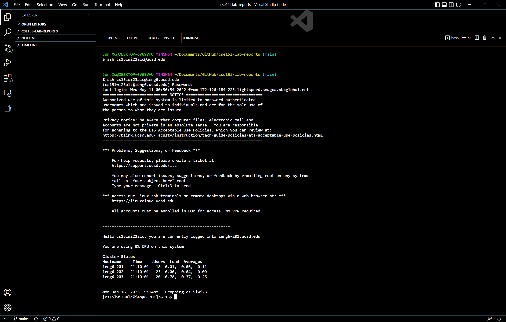
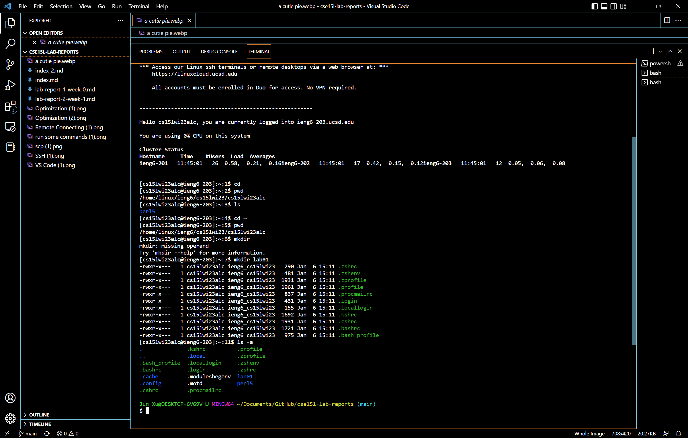

# A Tutorial on Remote Access: How to log into a course-specific account on ieng6
## 1. Installing VS Code
- Go to the [Visual Studio Code website](https://code.visualstudio.com/), and follow the instructions to download and install it on your computer.
  - There are versions for all the major operating systems, like macOS (for Macs) and Windows (for PCs).

- When it is installed, you should be able to open a window that looks like this (it might have different colors, or a different menu bar, depending on your system and settings):

## 2. Remotely Connecting
- [Look for your CSE 15L course-specific account](https://sdacs.ucsd.edu/~icc/index.php) and note down your account name, it should be in this format: **cs15lsp23zz@ieng6.ucsd.edu**, where "zz" is replaced with another 2 letters. Reset your account password as [instructed](https://docs.google.com/document/d/1hs7CyQeh-MdUfM9uv99i8tqfneos6Y8bDU0uhn1wqho/edit).
- In the terminal you opened in VS Code, use command **ssh cs15lwi23zz@ieng6.ucsd.edu** (replace cs15lwi23zz with your CSE 15L account name) to log into UCSD's remote server. 
- If you get prompted to type yes/no, type yes and hit enter.
- You should be prompted "Password:". Enter your new password. Your terminal should look like: 

## 3. Trying Some Commands
- Now that you have logged into the school's server, you are working with the server instead of your local computer. Commands entered in the terminal will be executed on the server while you are logged in. Here's some basic command lines you can try on the server:

  - cd ~
  - cd
  - ls -lat
  - ls -a
  - ls <directory> where <directory> is /home/linux/ieng6/cs15lfa22/cs15lfa22abc, where the abc is one of the other group members’ username
  - cp /home/linux/ieng6/cs15lfa22/public/hello.txt ~/
  - cat /home/linux/ieng6/cs15lfa22/public/hello.txt
- To log out of the remote server, use:
  - Ctrl+D
  - **exit** command
- Here's some examples of running commands on the remote server:
