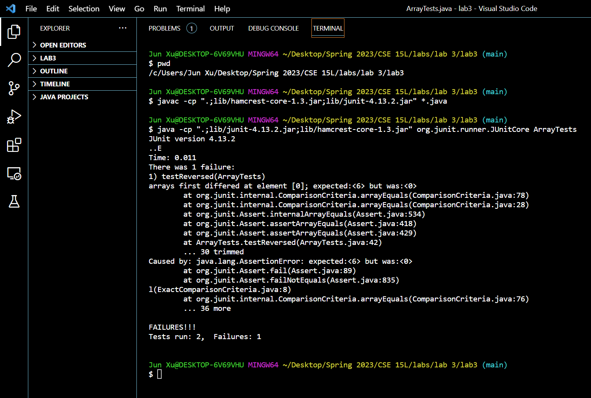

# Servers and Bugs
## Part 1
The code for my StringServer is [here](StringServer.java).

2 screenshots of using /add-message:
- 
  - At first, the `main` method is run (called with the argument, **7777**) and `parseInt` method is called with the argument, **7777**, which is the port number I entered in the terminal). The StringHandler class's int field, `portNum`, is then assigned the int value, **7777**, that the parseInt method returns. Then the `start` method in Server.java is called with arguments **portNum** the field and **an instance of StringHandler the class** (this instance is returned by StringHandler's constructor via calling the constructor with the arugmment, portNum the field). During the execution of the start method, the `handleRequest` method is called with the argument that's the entire url of the webpage, **http://localhost:7777/**, and recognizes that the initial url's path is /, therefore prints out texts that instruct the user to input texts they want to print on the webpage. After the String, **"myString"**, is entered in the instructed format, handleRequest is again called with the updated url of the webpage, **http://localhost:7777/add-message?=myString**, and extracts the user's input String and concatenate the user's String to the class StringHandler's field `x`, which is **initialized as an empty String**. At last, the handleRequest method returns a String by making the method call, String.`format(x)` and the user's input String, **"myString"**, is printed on the webpage.
- 
  - The `main` method, the `parseInt` method, and the `start` method are called in the previous screenshot. The `handleRequest` method is again called with the argument, the entire url that's **http://localhost:7777/add-message?=https://www.youtube.com/** in this screeshot and contatenate the user's String, **https://www.youtube.com/** to the field `x`. Therefore, field `x` is now this String: "myString\n2023\nhttps://www.youtube.com/". Then `handleRequest` method returns a String by making the method call, `String.format(x)`, and the returned String, **myString\n2023\nhttps://www.youtube.com/** is printed on the webpage. The field `portNum` is not changed and remians **7777**.

## Part 2
The buggy method I choose from lab 3 is `static int[] reversed(int[] arr)` in `ArrayExamples.java`.

- the entire junit test for `static int[] reversed(int[] arr)`:
  ```
  @Test
  public void testReversed() {
    int[] input1 = { };
    assertArrayEquals(new int[]{ }, ArrayExamples.reversed(input1));

    // My tests:
    int[] input2 = {1,2,3,4,5,6};
    assertArrayEquals(new int[]{6,5,4,3,2,1}, ArrayExamples.reversed(input2)); // failure #1
  
    int[] input3 = {-1, 1};
    assertArrayEquals(new int[] {1, -1}, ArrayExamples.reversed(input3));
  }
  ```

- A failure-inducing input: {1,2,3,4,5,6}, as shown in the code below:
  ```
  int[] input2 = {1,2,3,4,5,6};
  assertArrayEquals(new int[]{6,5,4,3,2,1}, ArrayExamples.reversed(input2)); // failure #1
  ```
- An input that doesn’t induce a failure: {-1, 1}, as shown in the code below:
  ```
  int[] input3 = {-1, 1};
  assertArrayEquals(new int[] {1, -1}, ArrayExamples.reversed(input3));
  ```
- The symptom:
  
- The bug, as the before-and-after code change required to fix it:
  - before:
    ```
    // Returns a *new* array with all the elements of the input array in reversed 
    // order
    static int[] reversed(int[] arr) {
      int[] newArray = new int[arr.length];
      for(int i = 0; i < arr.length; i += 1) {
        arr[i] = newArray[arr.length - i - 1];
      }
      return arr;
    }
    ```
  - after:
    ```
    // Returns a *new* array with all the elements of the input array in reversed
    // order
    static int[] reversed(int[] arr) {
      int[] newArray = new int[arr.length];
      for(int i = 0; i < arr.length; i += 1) {
        newArray[i] = arr[arr.length - i - 1];
      }
      return newArray;
    }
    ```
- Why the fix addresses the issue:
  - The fix addresses the issue because the before-code-change method alters the elements of the argument array, arr, and returns arr instead of initializes and returns newArray, the array that `static int[] reversed(int[] arr)` is expected to fill with all elements of arr in the reversed order and return. I have 1) changed the array, whose elements are altered in the for loop, from arr to newArray, and 2) changed the returned array from arr to newArray as well, which addresses the bug that alters and returns the wrong array. I also wrote additional junit tests after making the code change and all tests passed, which is decent evidence that my fix addresses the issue.

## Part 3
A new thing I learned is that different IDEs renders Markdown syntaxes differently. VS Code and GitHub's Markdown rendering is pretty much the same with each other but when I tried using a Markdown syntax that inserts tables in VS Code, GitHub seemed unable to recognize that Markdown syntax. After some web research, I leanred from GitHub's official page that they only support HTML syntaxes that insert tables. (I'm not 100% sure I'm correct, pls let me know if I'm wrong. =))