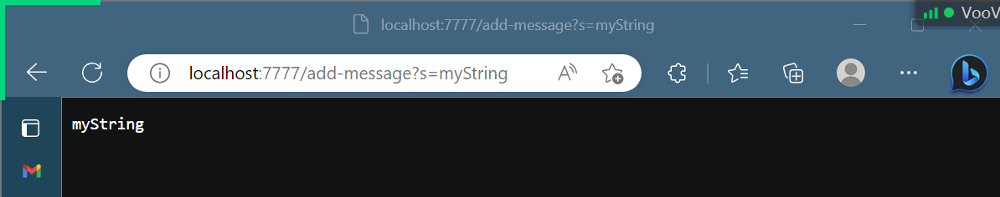
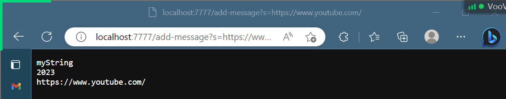

## the code for my StringServer:
[StringServer.java](StringServer.java)
## two screenshots of using /add-message.
- 
  - Which methods in my code are called?
    - At first, the **main** method is run (called with the argument, 7777) and **parseInt** method is called with the argument, 7777, which is the port number I entered in the terminal). The StringHandler class's int field, *portNum*, is then assigned the int value, 7777, that the parseInt method returns. Then the **start** method in Server.java is called with arguments portNum the field and an instance of StringHandler the class (this instance is returned by StringHandler's constructor via calling the constructor with the arugmment, portNum the field). During the execution of the start method, the **handleRequest** method is called with the argument that's the entire url of the webpage and recognizes that the initial url's path is /, therefore prints out texts that instruct the user to input texts they want to print on the webpage. After the String, myString, is entered in the instructed format, handleRequest is again called with the updated url of the webpage, http://localhost:7777/add-message?=myString, and extracts the user's input String and concatenate the user's String to the class StringHandler's field *x*, which is initialized as an empty String. At last, the handleRequest method returns a String by making the method call, String.**format**(x) and the user's input String, myString, is printed on the webpage.

- 
  - Which methods in your code are called?
    - The **main** method, the **parseInt** method, and the **start** method are called in the previous screenshot. The handleRequest method is again called with the argument, the entire url that's http://localhost:7777/add-message?=https://www.youtube.com/ in this screeshot and contatenate the user's String, https://www.youtube.com/ to the field x. Therefore, field x is now this String: `myString\n2023\nhttps://www.youtube.com/`. Then handleRequest method returns a String by making the method call, String.format(x), and the returned String, `myString\n2023\nhttps://www.youtube.com/` is printed on the webpage. The field portNum is not changed and remians 7777.
  - What are the relevant arguments to those methods, and the values of any relevant fields of the class?
  - How do the values of any relevant fields of the class change from this specific request? If no values got changed, explain why.

By values, we mean specific Strings, ints, URIs, and so on. "abc" is a value, 456 is a value, new URI("http://...") is a value, and so on.)
