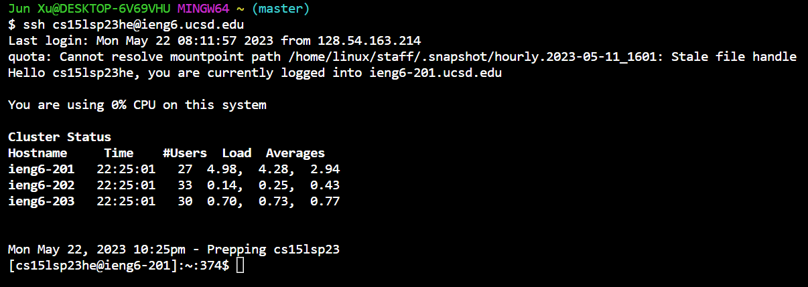
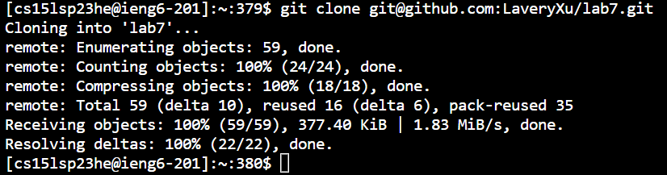
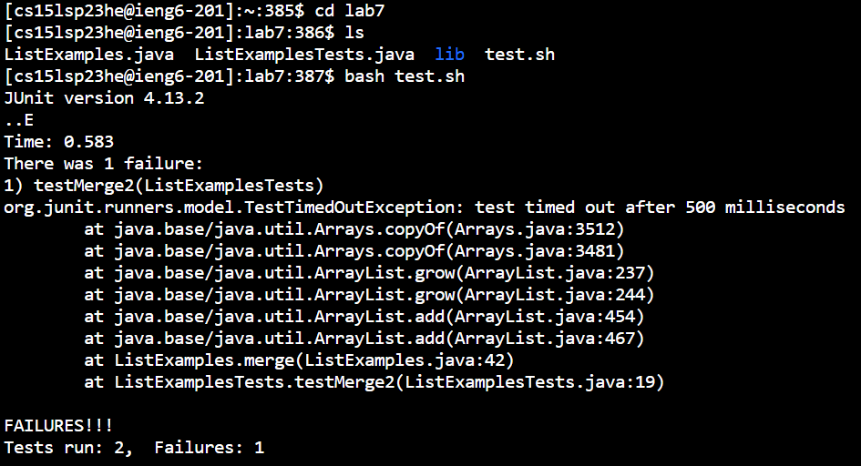
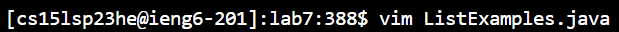
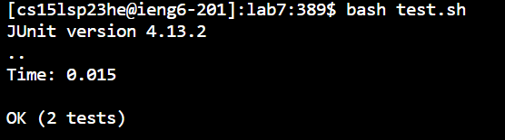
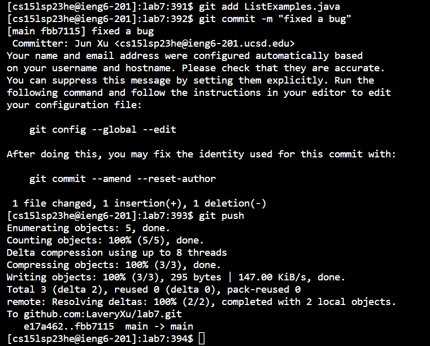

# Doing it All From the Command Line

4. Log into ieng6
      - 
      - command I ran: `ssh cs15lsp23he@ieng6.ucsd.edu`
        - keys pressed: ssh`<whitespace>`cs15lsp23he@ieng6.ucsd.edu`<Enter>`
        - effect of above keypresses: logs into my ieng6 account
5. Clone your fork of the repository from your Github account
      - 
      - command I ran: `git clone git@github.com:LaveryXu/lab7.git`
        - keys pressed: git`<whitespace>`clone`<whitespace>`git@github.com:LaveryXu/lab7.git`<Enter>`
        - effect of above keypresses: clones my fork of [this repository](https://github.com/ucsd-cse15l-s23/lab7.git) from my GitHub account
6. Run the tests, demonstrating that they fail
      - 
      - commands I ran: `cd lab7`, `ls`, and `bash test.sh`
        - keys pressed: cd`<whitespace>`lab7`<Enter>`, ls`<Enter>`, bash`<whitespace>`test.sh`<Enter>`
        - effect of above keypresses: `cd lab7` changes the working directory to lab7, `ls` lists all unhidden files under the current working directory lab7, and `bash test.sh` runs the tests in ListExamplesTests.java.
7. Edit the code file to fix the failing test
      - 
      - command I ran: `vim ListExamples.java`
        - keys pressed: vim`<whitespace>`List`<Tab>`.java`<Enter>` and jjjjjjjlllll`<Delete>`i2`<Escape>`:wq
        - effect of above keypress: vim`<whitespace>`List`<Tab>`.java opens ListExamples.java in vim. jjjjjjjlllll`<Delete>`i2`<Escape>`:wq, in ListExamples.java opened in vim, moves the cursor down by 7 lines and then right by 5 whitespace characters, deletes the character 1 that's highlighted by the cursor, enters insert mode, inserts 2 where the cursor is, enters normal mode, saves the changes made, and quits vim.
8. Run the tests, demonstrating that they now succeed
      - 
      - command I ran: `bash test.sh`
        - keys pressed: bash`<space>`test.sh`<Enter>`
        - effect of above keypress: runs the tests in ListExamplesTest.java
9. Commit and push the resulting change to your Github account (you can pick any commit message!)
      - 
      - commands I ran: `git add ListExamples.java`, `git commit -m "fixed a bug"`, and `git push`
        - keys pressed: git`<whitespace>`add`<whitespace>`List`<Tab>`.java`<Enter>`, git`<whitespace>`commit`<whitespace>`-m`<whitespace>`"fixed a bug"`<Enter>`, and git`<whitespace>`push`<Enter>`
        - effect of each keypress: 
