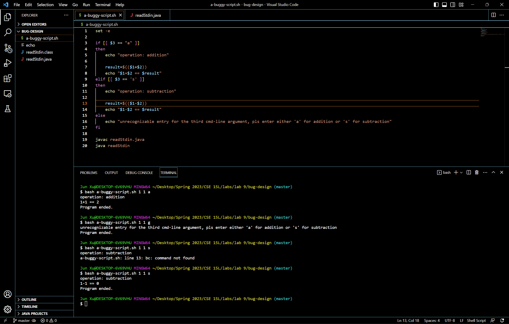
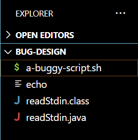
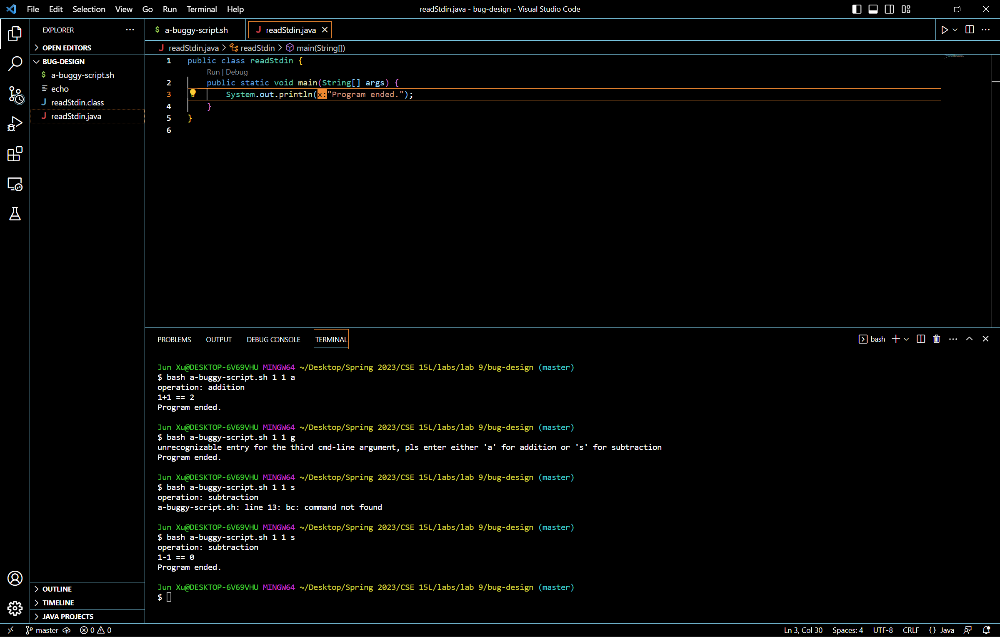

# Debugging Scenario and Reflection

## Part 1 – Debugging Scenario
- the student post:
  - The error message in the below screenshot indicates that bash doesn't recognize the command `bc`. However, during my preparation for Skill Demo 2, I saw that bash recognizes `bc` on the ieng6 servers but bash doesn't recognize `bc` on my computer. I think the reason my computer's bash doesn't recognize the command `bc` is because my computer's bash is not the latest version?
    
- the TA response:
  - You're right that your computer's bash doesn't recognize the command `bc`. Some bash functionalities such as the command `bc` need to be manually installed on a computer before usage for bash to be able to recognize them (the bash functionalities that need to be manually installed). You can either research online on how to install stuff for bash to become able to recognize the command `bc` or use other computational syntax.
- the student response to the above TA response:
  - Thanks for the explanation. The bug indeed is that my computer doesn't have `bc` stuff installed but the ieng6 servers do. I replaced the line that uses `bc` with a line that doesn't but uses another computational syntax. Afterward, the bug is fixed.
   

all the information needed about the setup:
1. The file & directory structure needed
    - 
2. The contents of each file before fixing the bug
    - 
3. The full command line (or lines) you ran to trigger the bug
    - `$ bash a-buggy-script.sh 1 1 s`
4. A description of what to edit to fix the bug
    - replaced the line with `bc` with `result=$(($1-$2))`

## Part 2 – Reflection
Prof. Joe's discussion about CS career planning was super helpful to me. It provides me insight of the CS industry and academia. I now can plan my career path with more confidence. =) 
