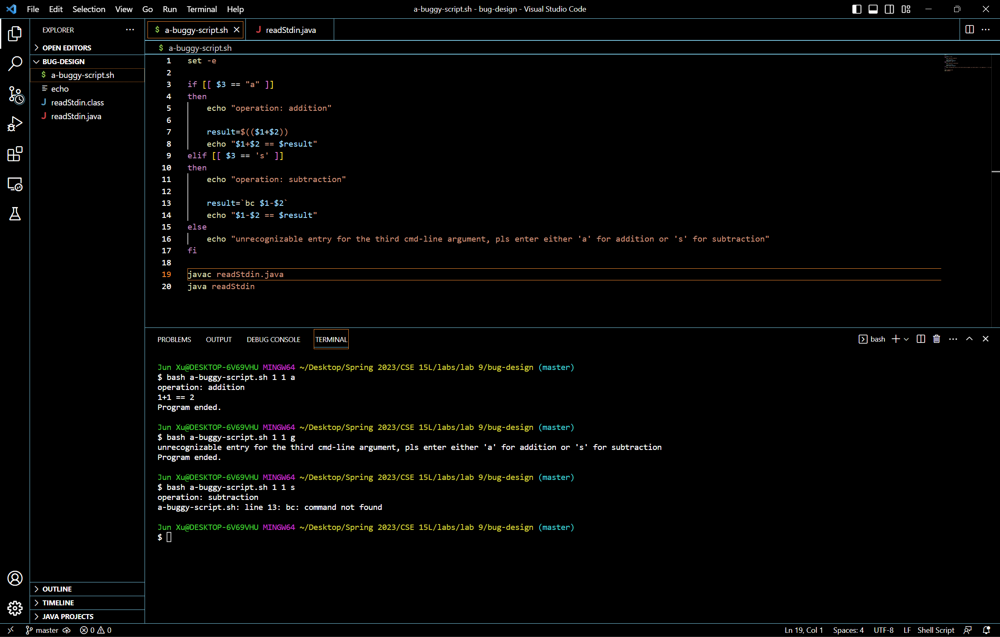

# Debugging Scenario and Reflection

## Part 1 – Debugging Scenario
Design a debugging scenario in the spirit and style of the ones above. Write your report as a conversation on EdStem. It should have:
- The original post from a student with a screenshot showing a symptom and a description of a guess at the bug/some sense of what the failure-inducing input is. (Don’t actually make the post; just write the content that would go in such a post)
  - The error message in the below screenshot indicates that bash doesn't recognize the command `bc`. However, during my preparation for Skill Demo 2, I saw that bash recognizes `bc` on the ieng6 servers but bash doesn't recognize `bc` on my computer. I think the reason my computer's bash doesn't recognize the command `bc` is because my computer's bash is not the latest version?
    
- A response from a TA asking a leading question or suggesting a command to try (To be clear, you are mimicking a TA here.)
  - You're right that your computer's bash doesn't recognize the command `bc`. Some bash functionalities such as the command `bc` need to be manually installed on a computer before usage for bash to be able to recognize them (the bash functionalities that need to be manually installed). You can either research online on how to install stuff for bash to become able to recognize the command `bc` or use other computational syntax.
3. Another screenshot/terminal output showing what information the student got from trying that, and a clear description of what the bug is.
  - 
At the end, all the information needed about the setup including:
1. The file & directory structure needed
2. The contents of each file before fixing the bug
3. The full command line (or lines) you ran to trigger the bug
4. A description of what to edit to fix the bug
You should actually set up and run the scenario from your screenshots. It should involve at least a Java file and a bash script. Describing the bug should involve reading some output at the terminal resulting from running one or more commands. Design an error that produces more interesting output than a single message about a syntax or unbound identifier error – showcase some interesting wrong behavior! Feel free to set this up by cloning and breaking some existing code like the grading script or code from class, or by designing something of your own from scratch, etc.

## Part 2 – Reflection
In a couple of sentences, describe something you learned from your lab experience in the second half of this quarter that you didn’t know before. It could be a technical topic we addressed specifically, something cool you found out on your own building on labs, something you learned from a tutor or classmate, and so on. It doesn’t have to be specifically related to a lab writeup, we just want to hear about cool things you learned!
